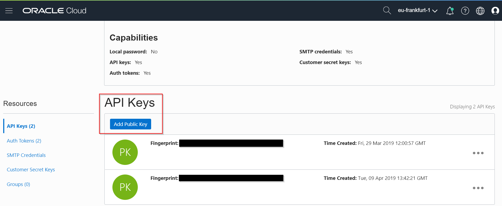

# Before you start...

**We need to configure our environment for OCI CLI or the SDKs**

## Create an API Signing Key

See: https://docs.cloud.oracle.com/iaas/Content/API/Concepts/apisigningkey.htm

Under your user settings, add the your API Signing Public Key

The fingerprint for the key will be displayed. 

## Create Config File

* Create a folder f.e. `.oci`
* Create a file `config` with the following content:

`
[DEFAULT]
user=<user OCID>  
fingerprint=<API key fingerprint>  
key_file=  
    C:\\Users\\shagedor\\Documents\\.oci\\oci_api_key.pem f.e. for Windows  
    /home/oracle/.oci/oci_api_key.pem f.e. for Linux  
tenancy=<tenancy OCDI>  
region=eu-frankfurt-1  
`
